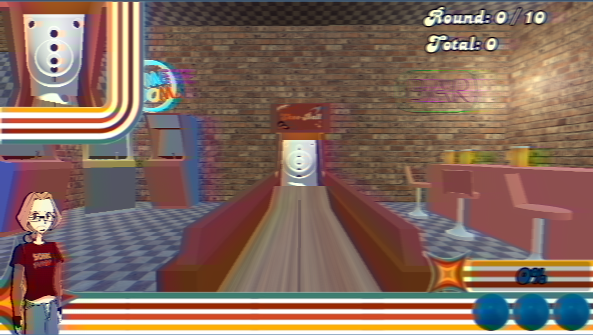
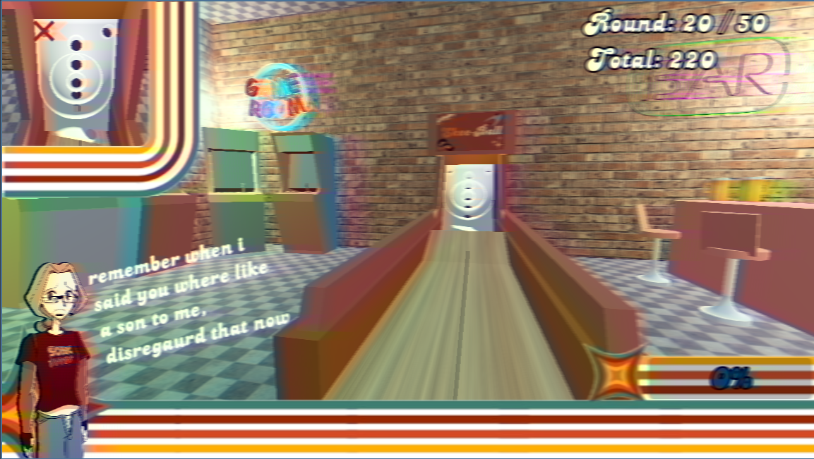
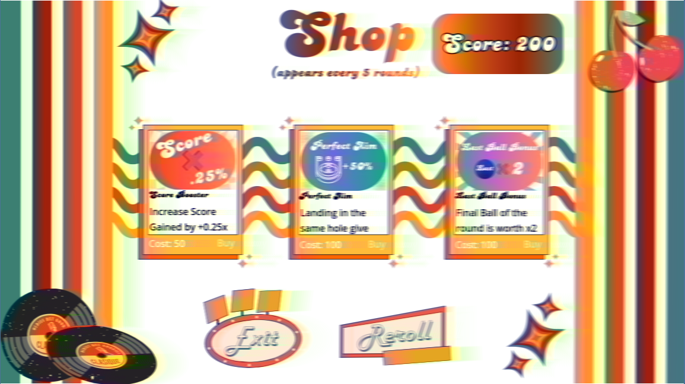
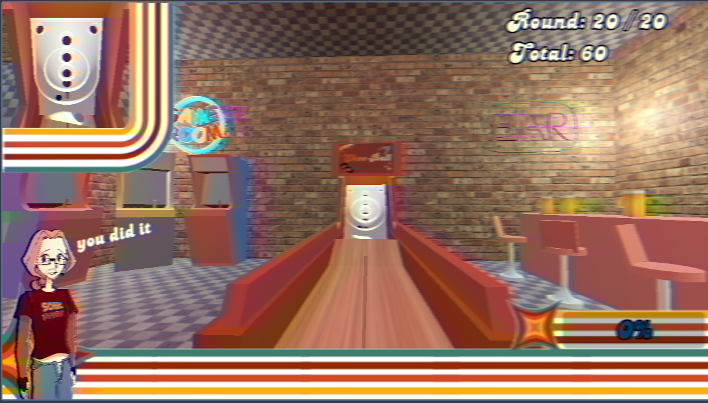

# Skee-Ball Ultimate Deluxe Mega-Edition (30th Anniversary Deluxe - The Expanded and Reworked Demos)
Imagine the game of skee-ball, already a peak game. But now, its a rougelike with shop mechanics and round goals.

Also greg is here. He's a bit mean sometimes.
## Where to Play
My Itch.io := [https://joshisyes.itch.io/skee-ball-ultimate-deluxe-mega-edition-30th-anniversary-deluxe-expanded](https://joshisyes.itch.io/skee-ball-ultimate-deluxe-mega-edition-30th-anniversary-deluxe-expanded)

## Controls
**Keyboard:**
- A / D or Left / Right Arrow - Moves the AimLine
- Enter (Hold) - Charges shot power, rlease enter to shoot\
**Mouse:**
- Click Buttons on the Menus + Shop

## Gameplay
### Rounds 1–5: Vanilla Play
- Pure Skee-Ball
- Just shoot ball and score points
- No modifiers, no shop and no locked holes

### Round 5+
- Shop appears every 5 rounds
- Spend points on powerups like:
	- Extra balls
	- Score multipliers
	- Shop frequency upgrades
- Hole Locking begins
	- Random holes are disabled each round
	- Every 5 rounds, another hole is lost
	- Locked holes reduce scoring options but can be mitigated later through upgrades

The game continues until you can no longer score (my max round was 72 btw)

## Game Constants w/ Images
**Hole Locking**
- Starts at Round 10
- Every 5 rounds, an additional hole is locked
- Number of locked holes per round is randomized

**Shop**
- First appears at Round 5
- Appears every 5 rounds
- Can be reduced to every 2 rounds via powerups

**Balls Per Round**
- Starts with 3 balls
- Can be increased with Extra Ball powerups

## Powerups
- **Score Surge**
	- First scoring ball each round gives double points

- **Perfect Aim**
	- Landing balls in the same hole consecutively grants +50% score

- **High Roller**
	- Top-row holes award bonus flat points

- **Combo Counter**
	- Consecutive scoring balls without missing increase a combo multiplier

- **Last Ball Bonus**
	- The final ball of the round is worth 2× points

---
## 3D Model Credits
- "PSX low poly Beer" (https://skfb.ly/oRqJL) by zhya is licensed under Creative Commons Attribution (http://creativecommons.org/licenses/by/4.0/).

## Music Credits
- Title: Autism Island, 
Author: Spring Spring, 
URL: https://opengameart.org/content/autism-island, 
License(s): * CC0 ( http://creativecommons.org/publicdomain/zero/1.0/legalcode ), 
Copyright/Attribution Notice: Spring

- Title:8-bit theme - Moving Right Along, 
Author:Wolfgang_, 
URL:https://opengameart.org/content/8-bit-theme-moving-right-along, 
License(s):* CC0 ( http://creativecommons.org/publicdomain/zero/1.0/legalcode ), 
